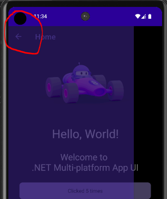

# Problem

This bug relates to the flyout menu. 

When the flyout initially appears, the hamburger icon is replaced with a 'back' icon. 

This can be seen if the flyout menu isn't completely opaque (see below).

# How To Replicate

To replicate the problem, follow these steps:
1. Click the hamburger icon.
2. Notice that when the flyout menu appears, the hamburger icon is replaced with a 'back' icon.
3. Interestingly, if you move the flyout menu even just slightly, the hamburger icon reappears.

# Environment

## Platform
Android 14

## Maui Version
9.0.0-rc.2.24503.2